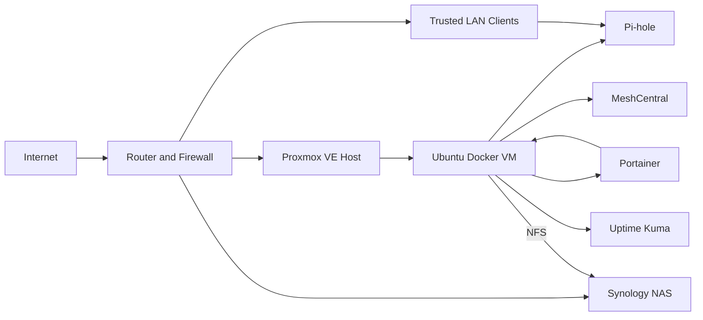

# Jonathan Homelab

This repository documents the homelab I built to practice infrastructure administration, virtualization, Linux, Docker, networking, storage, automation, and recovery procedures outside of a production environment.

I use repurposed business workstations as lab hardware instead of treating every system as a standalone desktop. Proxmox provides the virtualization layer, an Ubuntu virtual machine hosts containerized services, and a Synology NAS provides centralized NFS storage. I wrote the scripts in this repository to make routine checks and recovery tasks repeatable.

The public version is intentionally sanitized. It does not contain passwords, API keys, private certificates, public addresses, internal DNS records, or application data.

## What I built

- A Proxmox virtualization host running an Ubuntu Docker VM
- Centralized NFS storage backed by a Synology NAS
- Containerized infrastructure services managed with Docker Compose
- Network-wide DNS filtering with Pi-hole
- Container administration through Portainer
- Self-hosted remote administration with MeshCentral on the trusted network
- Preflight checks that verify storage and Docker before deployment
- Health, backup, restore, cleanup, and LVM expansion scripts
- GitHub Actions checks for shell syntax and Compose validity
- Operations, security, and troubleshooting documentation

## Architecture



## Repository structure

```text
.
├── .github/workflows/       Automated validation
├── compose/                 Sanitized Docker Compose examples
├── config/examples/         Environment and NFS mount examples
├── docs/                    Operations, security, and troubleshooting notes
└── scripts/                 Bash administration and recovery scripts
```

## Automation included

| Script | What I use it for |
|---|---|
| `homelab-preflight.sh` | Checks Docker, required commands, storage mounts, and free space before deployment |
| `stack-health.sh` | Reports filesystem status, active mounts, container state, restart counts, and Docker disk usage |
| `backup-configs.sh` | Creates timestamped configuration archives and SHA-256 checksums |
| `restore-configs.sh` | Reviews and restores a selected configuration archive with confirmation prompts |
| `docker-maintenance.sh` | Shows Docker storage usage and provides an explicit cleanup mode |
| `grow-ubuntu-lvm.sh` | Extends the Ubuntu LVM root filesystem after increasing the virtual disk in Proxmox |

## Example deployment workflow

```bash
git clone https://github.com/jdiaz6421/Jonathan-Homelab.git
cd Jonathan-Homelab
cp config/examples/homelab.env.example .env
nano .env
sudo mount -a
./scripts/homelab-preflight.sh
docker compose --env-file .env -f compose/core-services.yml config
docker compose --env-file .env -f compose/core-services.yml up -d
./scripts/stack-health.sh
```

I validate mounts before starting containers because a normal directory can still exist when an NFS mount fails. Without that check, Docker can write persistent data to the VM's local disk instead of the NAS. Turning that failure mode into a deployment check was one of the more useful lessons from building the lab.

## Security approach

- Administrative interfaces stay on the trusted LAN or behind VPN access.
- Secrets are stored outside the repository and excluded through `.gitignore`.
- Example files use placeholders instead of real infrastructure values.
- Services publish only the ports they need.
- Configuration backups are checksummed and should be encrypted before off-site storage.
- Changes are validated before deployment instead of being applied directly to running services.

## Current roadmap

- Add Prometheus and Grafana for centralized metrics
- Add alerting for storage, container, and host failures
- Automate Ubuntu VM provisioning with Ansible
- Add UPS-aware shutdown procedures
- Add encrypted off-site configuration backups
- Expand the lab with Windows Server, Active Directory, Group Policy, and hybrid identity testing

## Scope

This is a personal lab repository. The configurations are examples of how I organize and validate my own environment, not drop-in production templates. Anyone reusing them should review network exposure, permissions, image versions, backup requirements, and secrets for their own environment.

## License

This project is licensed under the MIT License. See [LICENSE](LICENSE).
